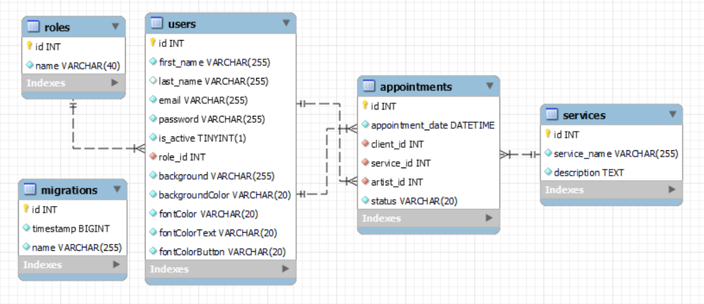

# Back - Escuela de skate

## Objetivo 🎯

Creación de una API para dar soporte a la parte frontal de una escuela de skate.

## Sobre el proyecto 📜

El Back está creado para llevar la gestión de citas de las distintas actividades de una escuela de skate. Este proyecto cuenta con una migración que permitirá al administrador modificar la imagen de fondo y los colores de los distintos elementos dentro de la página web.

## Stack 🛠️

 

## Diagrama BD 🏗️

## Características Principales ✅

● Registro de usuarios.

● Login de usuarios.

● Perfil de usuario.

● Modificación de datos del perfil (admin, profesor y cliente).

● Creación de citas (admin y cliente).

● Ver todas mis citas (profesor y cliente).

● Eliminar citas (admin y cliente).

● Edición de cita creada (admin y cliente).

● Edición de mis citas (cliente).

● Eliminar mi cita (cliente).

● Ver listar de profesores (admin).

● Ver todos los clientes registrados (admin).

● Creación de profesores (admin).

● Ver todos los clientes (admin).

● Ver una cita en detalle(admin, profesir y user).

● El admin puede modificar los roles de los usuarios del sistema.

● Validar la fecha de la cita (admin).

● Obtener modificaciones de imagen y color. (adminy, profesor, cliente y usuarios sin registrar).

● Generar modificaciones de imagen y color. (adminy, profesor, cliente y usuarios sin registrar).

## Instrucciones de instalación en local 📥

1. Clonar el repositorio
 `git clone`https://github.com/AbrahamGalvezV/Skate_School_Backend

2. Inicializar el proyecto
`npm init -y`

3. Instalar los módulos necesarios
 `npm i express`
 `npm i -D typescript`

4. Instalar tipos de nodo y express
 `npm i -D @types/node`
 `npm i -D @types/express`

5. Install additional modules
 `npm i cors`
 `npm i -D @types/cors`
 `npm i -D nodemon`
 `npm i -D ts-node`
 `npm i bcrypt`
 `npm i -D @types/bcrypt`
 `npm i @faker-js/faker`
 `npm i jsonwebtoken`
 `npm i -D @types/jsonwebtoken`
 `npm i dotenv`
 `npm i typeorm reflect-metadata mysql2`
 
6. Conecte el proyecto con la Base de Datos en la carpeta raíz del proyecto, busque .env-example para generar un archivo .env para tener las variables principales
    
    

7. Ejecutar las migraciones
    `npm run db:migrate`

8. Ejecutar las sembradoras
    `npm run db:seed` 

9. Ejecute el servidor
    `npm run dev`

## Endpoints principales 🧭

###Authentication 

    ##### REGISTER

        POST  ` /api/auth/register`

             JSON:
{
	"firstName": "Abraham",
	"lastName": "Gálvez",
	"email": "Abraham.Galvez.Vives@gmail.com",
	"password": "12345678",
	"isActive": true
}

    ##### LOGIN 

        POST  `/api/auth/login`

            JSON:

{
    "email": "Abraham.Galvez.Vives@gmail.com",
	"password": "12345678",
}

### USER

    ##### NUEVO USUARIO 

        POST  `/api/users`

             JSON:
{
	"firstName": "Abraham",
	"lastName": "Gálvez",
	"email": "Abraham.Galvez.Vives@gmail.com",
	"password": "12345678",
	"isActive": true
}

- Esta ruta puede ser usada por: admin.

+ Introducir token para la identificación.

    ##### LISTA DE USUARIOS

        GET  `/api/users?page=1&limit=200`

+ Introducir token para la identificación.

- Esta ruta puede ser usada por: admin y teacher.

    ##### DETALLES DE USUARIO

        GET  `/api/users/{id:}`

            + Introducir token para la identificación.

- Esta ruta puede ser usada por: admin y teacher.

    ##### MODIFICAR USUARIO (Se puede modificar cualquier parámetrodel usuario)

        PUT  `/api/users/{id:}`

             JSON:
{
	"email": "JuancohoChoas@gmail.com"
}

+ Introducir token para la identificación.

- Esta ruta puede ser usada por: admin.

    ##### ELIMINAR USUARIO 

        DELETE  `/api/users/{id:}`

- Esta ruta puede ser usada por: admin.

+ Introducir token para la identificación.

    ##### PERFIL DE USUARIO

        GET  `/api/users/7profile`

- Esta ruta puede ser usada por: admin,  teacher y client.

+ Introducir token para la identificación.

    ##### ACTUALIZAR PERFIL

        PUT  `/api/users/profile/update`

            body: Se incluye el o los parámetros a modificar

- Esta ruta puede ser usada por: admin, teacher y client.

+ Introducir token para la identificación.

    ##### EDITAR ROL

        PUT  `/api/users/edit/role/{id:}`

            JSON: 
            
{
	"roleId": 2
}

- Esta ruta puede ser usada por: admin.

+ Introducir token para la identificación.

### APPOINTMENT

    ##### VER TODAS LAS CITAS

        GET  `/api/appointments`

- Esta ruta puede ser usada por: admin.

+ Introducir token para la identificación.

    ##### OBTENER CITA BY ID

        GET  `/api/appointments/{id:}`

- Esta ruta puede ser usada por: admin, teacher y client.

+ Introducir token para la identificación.

    ##### NUEVA CITA

        POST  `/api/appointments`

            JSON:
{
	"appointmentDate": "2024-03-29 18:00:00",
	"clientId": 22,
	"serviceId": 2,
	"artistId": 3
}

- Esta ruta puede ser usada por: admin y client.

+ Introducir token para la identificación.

    ##### ACTUALIZAR CITA

        PUT  `/api/appointments/{id:}`

            JSON:
{
	"appointmentDate": "2024-03-29 18:00:00",
	"clientId": 32,
	"serviceId": 2,
	"artistId": 3
}

- Esta ruta puede ser usada por: admin.

+ Introducir token para la identificación.

    ##### ELIMINAR CITA

        DELETE  `/api/appointments/{id:}`

- Esta ruta puede ser usada por: admin,  teacher y client.

+ Introducir token para la identificación.

    ##### CITA BY CLIENT

        GET  `/api/appointments/client`

- Esta ruta puede ser usada por: client.

+ Introducir token para la identificación.

    ##### CITA BY ARTIST

        GET  `/api/appointments/artist`

- Esta ruta puede ser usada por: artist.

+ Introducir token para la identificación.

### SERVICIOS

    ##### LISTA DE SERVICIOS

        GET  `/api/services`

- Esta ruta puede ser usada por:admin, teacher y user.

    ##### LISTA DE ARTISTAS

        GET  `/api/services/artists`

- Esta ruta puede ser usada por:admin, teacher y user.

    ##### DETALLES SERVICIOS

        GET  `/api/services/{id:}`

- Esta ruta puede ser usada por:admin y teacher.

+ Introducir token para la identificación.

    ##### NUEVO SERVICIO

        POST  `/api/services`

- Esta ruta puede ser usada por:admin.

+ Introducir token para la identificación.

    ##### MODIFICAR SERVICIO

        PUT  `/api/services/{id:}`

            JSON: 
{
	"serviceName": "Piercing",
	"description": "Face"
}

- Esta ruta puede ser usada por:admin.

+ Introducir token para la identificación.

    ##### ELIMINAR SERVICIO

        DELETE  `/api/services/{id:}`

- Esta ruta puede ser usada por:admin.

+ Introducir token para la identificación.

### MODIFICATIONS

   ##### OBTENER MODIFICACIONES

        GET  `/api/modifications/1`

- Esta ruta puede ser usada por: admin, teacher, user y usuarios sin registrar.

   ##### ACTUALIZAR LAS MODIFICACIONES

        PUT  `/api/modifications/update/1`

+ Introducir token para la identificación.

- Esta ruta puede ser usada por: admin.

## Contacto

 

